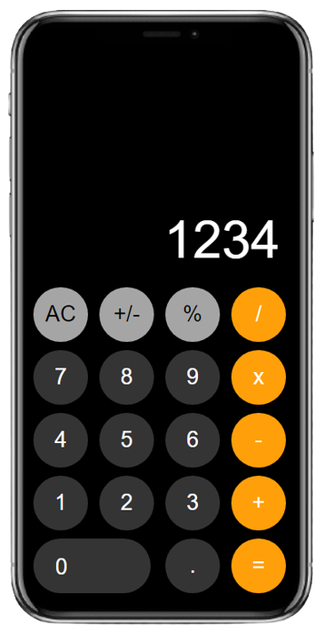

# iOS Calculator Clone

A web-based clone of the Apple iOS Calculator, built with HTML, CSS, and JavaScript.

**Live Demo:** [https://ios-calculator.daniyal-khan.com/](https://ios-calculator.daniyal-khan.com/)

## Features

- Clean iOS-style design with an iPhone frame
- Basic arithmetic: addition, subtraction, multiplication, division
- Percentage calculation (`%`)
- Sign toggle (`+/-`)
- Decimal point support
- AC (All Clear) reset button

## Tech Stack

- **HTML5** — page structure
- **CSS3** — styling and layout
- **JavaScript (Vanilla)** — calculator logic
- **jQuery 3.5.1** — DOM manipulation and event handling

## Project Structure

```
├── index.html
├── assests/
│   ├── css/
│   │   └── style.css
│   ├── js/
│   │   └── index.js
│   └── images/
│       ├── iphone.png
│       ├── calculator.png
│       ├── ios-calculator-link.png
│       └── favicon.ico
└── README.md
```

## Usage

| Button | Action |
|--------|--------|
| `AC` | Clear the display |
| `+/-` | Toggle positive/negative |
| `%` | Convert to percentage |
| `/` `x` `-` `+` | Set operator |
| `=` | Calculate result |
| `.` | Add decimal point |

## Author

**Daniyal Khan**
- Portfolio: https://daniyal-khan.com/
- GitHub: https://github.com/daniyal-khan-dev
- LinkedIn: www.linkedin.com/in/m-daniyal-khan
- Email: support@daniyal-khan.com

## Support

If you have any questions or need help, please:
- Open on Portfolio
- Open an issue on GitHub
- Connect on LinkedIn
- Contact via email

---

<div align="center">
  <h3>🌟 If you found this project helpful, please give it a star! 🌟</h3>
  
  [](https://ios-calculator.daniyal-khan.com/)
  
  
</div>
